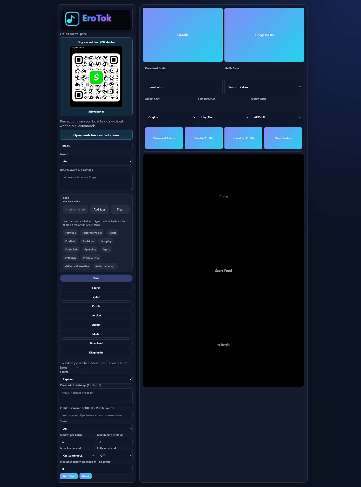
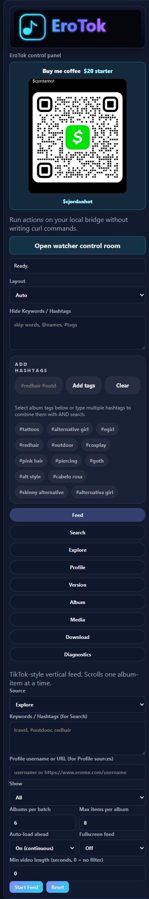

# EroTok / EromeAPI


EroTok is a local-first toolkit for exploring, previewing, indexing, watching, and archiving public Erome album pages that you are allowed to access. It combines a Python scraping/API layer, a Node.js bridge server, a browser-based control panel, profile watching, local SQLite search, and automation-friendly endpoints.

The project is designed for personal archiving, creator backups, public-page monitoring, and local workflow automation. It does not log in to Erome, bypass access controls, generate fake engagement, upload files, edit posts, or interact with private account features.

## Screenshots

### EroTok control panel



### Support QR and hashtag controls



## Highlights

| Area | What It Does |
| --- | --- |
| EroTok GUI | Local browser control panel at `http://127.0.0.1:3000/` |
| Vertical feed | TikTok-style public album/media preview with stable download progress UI |
| Search | Keyword, hashtag, multi-term, hide-term, and public-hidden result filtering |
| Hashtag chips | Suggested and selected hashtag chips with multi-word hashtag support |
| Downloads | Public album/media downloads with progress, retry visibility, and skip/overwrite controls |
| Watcher | Public profile snapshots, diffs, alert text, history, and local search index |
| API bridge | Node routes backed by Python methods for GUI, scripts, and automation |
| MCP/Hermes helpers | Optional local entrypoints for agent/tooling workflows |
| Userscript | Tampermonkey/Violentmonkey mini panel for Erome pages with a full-app upgrade link |

## Responsible Use

Use this project only for public content that you own, created, or have permission to archive. Do not use it to bypass access controls, scrape private/restricted content, rehost other people's media, evade platform rules, or download content where you do not have rights.

This repository is public-page and local-first by design:

- No Erome login automation
- No private account access
- No upload/edit/comment features
- No fake views or engagement generation
- No server-side media hosting
- No payment or paywall bypassing

## Quick Start

Install Python dependencies:

```bash
pip install -r requirements.txt
```

Start the local Node bridge and GUI from the project root:

```bash
node server.js
```

Open:

```text
http://127.0.0.1:3000/
```

Important: run `node server.js` from the nested project folder that contains `server.js`:

```text
EromeAPI-main/EromeAPI-main
```

Running it from the parent download folder will fail because that parent does not contain `server.js`.

## EroTok Control Panel

The root UI in `ui.html` gives you a local control room for common workflows:

- Health check
- Explore pages
- Keyword and hashtag search
- Public hidden search mode
- Public profile uploads and reposts
- Public album metadata
- Ordered album media preview
- Media URL preview
- Album and single-media download jobs
- Download progress polling
- Feed mode with vertical snap scrolling
- Layout modes for desktop and phone-like viewing
- Saved form settings in local project state

### Hashtag Search

The hashtag picker supports both simple tags and multi-word tags:

```text
#redhair #outdoor
#alternative girl, #egirl
```

Selected hashtag chips are combined with typed search terms. The backend searches broad public results first, enriches each candidate album with detail metadata, then requires matching hashtag metadata before returning filtered results.

### Hide Terms

Hide keywords or hashtags are applied locally to visible albums. This is useful for excluding usernames, terms, tags, or titles from feed and preview workflows without changing the upstream query.

## Userscript Mini Panel

The repo includes a userscript edition at:

```text
userscript/erotok.user.js
```

Install it with Tampermonkey, Violentmonkey, or another compatible userscript manager. The script injects an `EroTok Mini` panel on public `https://www.erome.com/*` pages.

What the userscript can do:

- Search public albums through your local EroTok server
- Load Explore results
- Load the current public profile when you are on a profile page
- Download the current public album page through the local server
- Use suggested hashtag chips and multi-word hashtag parsing
- Apply hide-term filtering to displayed userscript results
- Persist mini-panel settings with userscript storage
- Open the full local EroTok app at `http://127.0.0.1:3000/`
- Link back to this GitHub repo for the full version

The userscript intentionally delegates search, preview, and downloads to the local server. Browser userscripts cannot reliably save files, manage download jobs, or reuse the full Python/Node pipeline by themselves.

Userscript flow:

```bash
node server.js
```

Then browse to a public Erome page. The `EroTok Mini` panel appears in the lower-right corner.

## Python API Example

```python
from api import Api

api = Api()

# Search public albums.
albums = api.get_all_album_data("#alternative girl, #egirl", page=1, limit=2)

# Get ordered public album media URLs.
content = api.get_album_content("https://www.erome.com/a/RHoERFQP")

# Get album metadata plus duplicate-free media items.
album = api.get_album_info("RHoERFQP")

# Download a public album locally.
downloaded = api.download_album(
    "RHoERFQP",
    directory="Downloads",
    include_photos=True,
    include_videos=True,
    overwrite=False,
    max_workers=4,
)
```

## Return Shapes

`get_all_album_data()` and `get_explore()` return public album cards:

```python
[
    {
        "title": "Album title",
        "thumb": "https://...",
        "url": "https://www.erome.com/a/...",
        "views": 1234,
        "images": 8,
        "videos": 2,
        "duration_seconds": 120,
    }
]
```

`get_album_content()` returns raw public media URLs:

```python
{
    "videos": [{"video_url": "https://...", "thumb_url": "https://..."}],
    "photos": ["https://..."],
}
```

`get_album_info()` returns metadata plus media in page order:

```python
{
    "slug": "RHoERFQP",
    "url": "https://www.erome.com/a/RHoERFQP",
    "title": "Album title",
    "username": "Uploader",
    "media": [
        {"type": "photo", "url": "https://...jpg"},
        {"type": "video", "url": "https://...mp4", "thumb_url": "https://...jpg"},
    ],
}
```

`download_album()` returns per-file results:

```python
[
    {
        "type": "photo",
        "url": "https://...jpg",
        "filename": "Album title (1).jpg",
        "path": "Downloads/Album title (RHoERFQP) [Uploader]/Album title (1).jpg",
        "status": "downloaded",
    }
]
```

Existing files are skipped unless `overwrite=True` is passed.

## Node API Routes

The local server exposes GUI-friendly endpoints under `/api`:

```text
GET  /health
GET  /api/search?keyword=...&page=1&limit=2
GET  /api/hidden-search?keyword=...&page=1&limit=2
GET  /api/explore?page=1&limit=2&new=false
GET  /api/profile?profile=username&page=1&limit=0&content=albums|reposts
GET  /api/album/info?path=RHoERFQP
GET  /api/album/content?path=RHoERFQP
GET  /api/album/metadata?path=RHoERFQP
POST /api/download/jobs
POST /api/download/media/jobs
GET  /api/download/jobs/<job-id>
GET  /api/settings
POST /api/settings
GET  /api/state
GET  /api/diagnostics
```

Download jobs are asynchronous so the UI can poll for progress without freezing the page.

## Watcher Features

The integrated watcher tools are available from the main project root. They remain public-content-only and store local snapshots/search metadata in SQLite.

### Node watcher routes

```text
GET  /api/watcher/health
GET  /api/watcher/profile/<username>
GET  /api/watcher/profile/<username>/diff
GET  /api/watcher/profile/<username>/history?limit=20
POST /api/watcher/watch
POST /api/watcher/watch/alert
GET  /api/watcher/album?url=https://www.erome.com/a/...
GET  /api/watcher/index/stats
POST /api/watcher/index/profile
POST /api/watcher/index/explore
POST /api/watcher/index/rebuild
GET  /api/watcher/search?query=...&sort_by=relevance|recent|views|title&limit=20
GET  /api/watcher/search/live?query=...&page=1
```

The watcher dashboard is served at:

```text
http://127.0.0.1:3000/watcher
```

If the watcher dashboard bundle is missing, build it with:

```bash
cd erome-watcher/gui
npm install
npm run build
```

### Standalone watcher REST API

```bash
python watcher_api_server.py
```

Default URL:

```text
http://127.0.0.1:8011/
```

### MCP, CLI, and Hermes helpers

```bash
python erome_mcp_server.py
python watch_profile.py SOME_USERNAME --format summary
python post_alert_to_hermes.py YOUR_WEBHOOK_URL SOME_USERNAME
```

## Project Structure

```text
api.py                         Python public-page API wrapper
api_bridge.py                  JSON bridge used by the Node server
server.js                      Local Node server, GUI host, proxy, jobs, watcher routes
ui.html                        EroTok browser control panel
app/assets/cashapp-qr.jpg      Optional support QR displayed in the GUI
userscript/erotok.user.js      Tampermonkey/Violentmonkey EroTok Mini panel
watcher_*.py                   Root watcher entrypoints
erome-watcher/                 Integrated watcher package and dashboard source
tests/                         Python unittest coverage
```

## Tests

Run the full suite:

```bash
python -m unittest discover -s tests
```

Useful syntax checks:

```bash
python -m py_compile api.py api_bridge.py
node --check server.js
```

Current local verification:

```text
36 tests passing
```

## Public Repository Safety

The `.gitignore` intentionally excludes local runtime state and downloaded media:

- `Downloads/`
- `downloads/`
- `state.json`
- `*.sqlite3`
- `erome-watcher/state/`
- local test output files
- Python caches and virtual environments

Before publishing, check:

```bash
git status --short
```

Make sure no private media, credentials, local state, cookies, tokens, or personal downloads are staged.

## Support

The local GUI includes a Cash App QR support card for `$cjordanhot`. It is QR-first so users can scan with the Cash App mobile flow instead of relying on a web payment page.

## License

See `LICENSE`.

## Disclaimer

This is an unofficial local tool for public pages. Erome does not provide an official public API for this project. Use responsibly, respect creator rights, and follow all applicable laws and platform terms.
